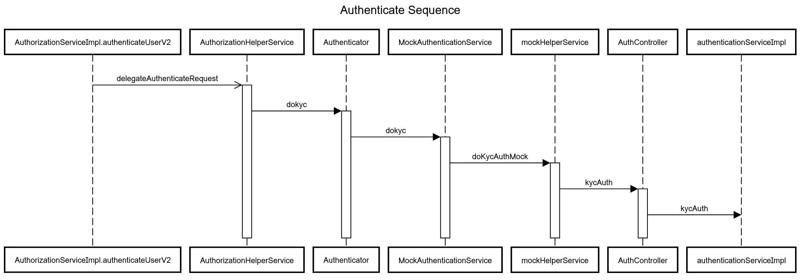

# TOTP Implementation for MOSIP eSignet

# 1. INTROUDCTION
In these times of digital transformation, most services are moving online globally. Personalized access to online services is enabled through
the use of a trusted digital identity. **e-Signet** aims to offer a simple yet powerful mechanism for end users to identify themselves in order to
avail of online services and also share their profile information. e-Signet supports multiple modes of identity verification to promote inclusion
and increase access, thus narrowing potential digital divides.

e-Signet also provides an elegant and easy way for an existing trusted identity database to make the identity digital and provision identity
verification and service access.

MOSIP eSignet is standard based authentication service interface which can work with any authentication provider.

Please refer to [MOSIP eSignet](https://docs.mosip.io/1.2.0/integrations/e-signet) documentation for more information.

eSignet implements [OpenID Connect](https://openid.net/connect/) and [OAuth 2.0](https://oauth.net/2/) flows.

Platform today supports few authentication mechanisms such as biometric , OTP and Wallet. we would like to extend to Time-based-one-
time Password, shortly referred to as TOTP authentication.

RFC 6238 ( [RFC 6238: TOTP: Time-Based One-Time Password Algorithm](https://datatracker.ietf.org/doc/html/rfc6238) )

| Key Information |      Value      |
|----------|:-------------|
| Complexity Level |  Medium |
| Team Size |    3-4   |
| Timeline | Not more than 45 days |
| Tech Stack | Java/Springboot/REST/JSON   React/node   RFC 6238, RFC 4226,RFC 2104 ,  OpenID Connect, OAuth 2.0, MDS |
| eSignet Target version | Branch 1.2.x |

# 2. MOTIVATION

- OTP over email requires to have email access and could be delivered with a delay. Many a times OTP is delivered after expiry time
- which is not so comfortable experience for the user. SMS requires Telco/Aggregator support and adds to cost.
- TOTP implementation would allow users to use third party authenticators such as Google Authenticator which support IETF RFC 6238.
- TOTP is more secure mechanism
- Hence we need a solution which implements TOTP in eSignet.

# 3. CURRENT ARCHITECTURE

Please refer [Components](https://docs.esignet.io/overview/components) for details on the current architecure.

# 4. REQUIREMENTS & SOLUTION APPROACH

## 4.1 Requirement

Implement TOTP feature as per RFC 6238 in MOSP eSignet as explained below.

## 4.2 High level Solution Approach

### 4.2.1 Enable binding of standard TOTP based authenticator app with a specific user’s identity

- Create a new spring boot based application for enabling the TOTP key - User identity binding (** we keep this as new application, because it will guard from polluting the eSignet ui and server code to achieve this functionality)
- Create a UI page that offers users to enable TOTP based authentication support to their trusted digital ID
- In the UI page, request the user to Sign In using their trusted ID
- Login process should follow the OIDC flow where this new app become one of the relying party
- Once user logs in, display a QR code containing a random key and instruct the user to scan the keys into the authenticator app
- Once user confirms the action, call the new key binding API endpoint of the eSignet application (This new method invocation will be based on the access token)
- This new endpoint services needs to be part of the binding service where it has new method to do direct key bindings
- This new binding service method calls the new method in the key binder plugin interface which has a new method for doing secret key based binding (this method invocation will be passing the kyc token)
- The mock plugin impl will implement this new method where it will encrypt and store the keys in the same record where the identity information is stored

### 4.2.2 Enhance eSignet to support the TOTP generated in the binded authenticator app as an authenticator factor

- eSignet UI to be customised to add a button in the login page to support TOTP
- On click of that we should show the login page which will request for individual id and TOTP
- Send the request to the authenticate API endpoint and it will reach the plugin and then finally the mock ID system. (except for some enum and config changes there should not be much code changes here)
- Mock ID system will reach to its DB, get the key, decrypt it and it will call the otp manager to handle the validation of OTP along with locking the users on multiple retries etc..

## 4.3 Modules & APIs to be developed or refactored

### 4.2.1 New Modules to be developed

#### 4.2.1.1 TOTP Binder Application

- Build an Web Application using Java Spring boot RESTFul API Service and a React Front end application which connects to this backend. This application is Resident facing and allows them to bind their trusted ID ( ex: UIN/VID) with TOTP Service.
- A mock application developed in Node and React is available here (Appendix)
- In landing page following links/buttons should be provided
  - A link should be provided for Sign in with e-Signet (esignet-login-link) - Plugin can be used
  - A link/button for generating symentric key and displaying it as QR code ( This link should be enabled only if login is successful ) (generate_totp_token_link)
  - A link/button for confirming to bind the above generated random key ( This link should be enabled only if random token was generated ) (confirm_bind_token_link)
- Need to implement the following UseCases
- Login Flow
  - login flow similar to the above mock implementation calling eSignet login UI. User will input trusted ID ( UIN/VID). He may choose OTP based authentication.
  - Once user clicks esignet-login-link, login web-ui should appear from eSignet portal
  - Please consider only OTP based login for this project
  - Once login is successful control returns to application along with authorization code
  - Call /token API to send authorization code and and receive the access token
    - Access token is generated by eSignet service and saved in cache against a computed hash of access token.
    - This API will return access token
  - You may refer to this document to understand the flow and UI
  - We would require email ID as Essential claims
- Generate Unique Token
  - On click of generate_totp_token_link, generate a random unique key , encode in base64 , generate a QR code which embedd this key, and present in the page.
  - Resident will scan the QR code from authentication App to register in authenticator App

- Confirm binding above Token with eSignet
  - Call the new TOTP-binding API passing the eSignet access token, TOTP Random Key and other required parameters

### 4.2.2 New APIs to be developed

- TOTP-binding
  - Build a new TOTP Binder API in eSignet/eSignet-services , eSignet/binding-service-impl
  - Add new API code in keyBindingController , KeyBindingServiceImpl similar to wallet-binding API.
  - This API takes in eSignet Access token , TOTP Random key and trusted Id (individual id) as parameters in addition to other required parameters
  - TOTP Random key to be taken in JWK format
  - Add a method bindTOTP in KeyBindingServiceImpl class
    - Validate access token against cache and if valid then save the binding in registry as in bindwallet method
  - Call the KeyBinder doKeyBinding method passing the TOTP key in the publicKeyJWK argument
  - Do changes in MockKeyBindingWrapperService doKeyBinding method to call the new API endpoint in mock identity system
  - This new endpoint (key-binding) in mock idenity system should have a new controller and service layer to finally encrypt and store the TOTP keys in the databases with a mapping to the identity
  - return success/failure

### 4.2.3 Modules to be refactored

#### 4.2.3.1 eSignet-UI (eSignet/oidc-ui)

- Add new mode of login **_Login with TOTP_** to Login Page
- On selection of this option navigate to a new page Login with TOTP , similar to OTP Login page
- Here prompt for Individual ID and TOTP value
  - User would generate the TOTP value using the authenticator App and enter the same value in above attribute along with his/her trust
id
- Provide a **verify** button (verify_link), and on click of this , call modified Authenticate API
- On return from this API, implement the consent flow as usual

#### 4.2.3.2 Authenticate End point ( [Authentication Endpoint V2 | Identity Provider](https://mosip.stoplight.io/docs/identity-provider/fyrtfdg35t4zs-authentication-endpoint-v2) )

| Class Name |      Repo      |
|----------|:-------------|
| AuthorizationServiceImpl |  [https://github.com/mosip/esignet/tree/v1.2.0/oidc-service-impl](https://github.com/mosip/esignet/tree/v1.2.0/oidc-service-impl) |
| AuthorizationHelperService |    [https://github.com/mosip/esignet/tree/v1.2.0/oidc-service-impl](https://github.com/mosip/esignet/tree/v1.2.0/oidc-service-impl)   |
| Authenticator - Interface | [https://github.com/mosip/esignet/tree/v1.2.0/esignet-integration-api](https://github.com/mosip/esignet/tree/v1.2.0/esignet-integration-api) |
| MockAuthenticationService | [https://github.com/mosip/esignet-mock-services/tree/v0.9.1/mock-esignet-integration-impl](https://github.com/mosip/esignet-mock-services/tree/v0.9.1/mock-esignet-integration-impl) |
| MockHelperService | [https://github.com/mosip/esignet-mock-services/tree/v0.9.1/mock-esignet-integration-impl](https://github.com/mosip/esignet-mock-services/tree/v0.9.1/mock-esignet-integration-impl)  |
| AuthenticationServiceImpl | [https://github.com/mosip/esignet-mock-services/tree/v0.9.1/mock-esignet-integration-impl](https://github.com/mosip/esignet-mock-services/tree/v0.9.1/mock-esignet-integration-impl)  |

- Follow the flow and modify the parameters to add/modify if required
  - Mock implementation in esginet-mock-services , in method kycAuth of AuthentionServiceImpl class, default implementation fetches
  - already generated with otp and compares with passed otp value.
  - Need to change the above logic to implement TOTP validation, by calling OTPManager API.
  - Invoke otpvalidator API from OTP Manager.

#### 4.2.3.3 Changes in OTP Manager

##### 4.2.3.3.1 Enhance OTP Manager

- Enhance OTPValidator API to support protocol selection ( OTP/TOTP), and addtional required parameters
- Enhance validateOtp method in OtpValidatorServiceImple class to support protocol selection and additional required parmeters if any
- Implement the logic of generating TOTP against the passed key and comparing it with the passed TOTP value and return success/failure
- Implement validations such as TTL, Once use etc

## 4.4 Development Environment

- Developers could fork from MOSIP gitrepo, all required Repos of specified branch and develop/debug locally
- Refer to Local Deployment guide for more details, which also covers how to insert test data ( identity, partner details etc) using curl command.
- One could run the all necessary apps locally with custom implementation of TOTP and test locally
- To test locally , one could use Google Authenticator
- Prepare test data & scripts to import into local database as per Local Deployment Guide

## 4.5 Deployment , Testing & Submission

- Submission shall be done by committing artefacts into the forked respective repo and raising pull request
- MOSIP Dev-ops team will verify, build and deploy to test sandbox and provide access to dev team
- Dev Team runs the tests and provides the report

# 5. DELIVERABLES

- All required Repos are forked from MOSIP Git Repo
- Raise pull request for all the customised code
- Check in the test scripts/cases, test reports
- Demo videos showcasing the working use-cases
- Any relevant documentation
- Deployment Script
  - Develop Docker composer scripts for local deployment of all services and running test scripts if any
  - Submit the same as part of deliverables
- Test data & scripts

# 6. APPENDIX

## 6.1 Reference Repos & URLS

### 6.1.1 MOSIP github

#### [https://github.com/mosip/](https://github.com/mosip/)

### 6.1.2 MOSIP OTP Manager Repo

[GitHub - mosip/otp-manager](https://github.com/mosip/otp-manager)

### 6.1.3 OTP Manager Service : version release-1.2.0.1-B

OTP Generation and Validation service

[https://github.com/mosip/otp-manager/tree/develop/kernel/kernel-otpmanager-service](https://github.com/mosip/otp-manager/tree/develop/kernel/kernel-otpmanager-service)

### 6.1.4 eSignet github

#### [GitHub - mosip/esignet at release-1.2.x](https://github.com/mosip/esignet/tree/v1.2.0)

### 6.1.5 eSignet Mock Implementations Repo

[GitHub - mosip/esignet-mock-services: Repository contains mock implementation of auth for e-signet](https://github.com/mosip/esignet-mock-services)

### 6.1.6 Mock Relying Party Application

**Back end**

[https://github.com/mosip/esignet-mock-services/tree/master/mock-relying-party-service](https://github.com/mosip/esignet-mock-services/tree/master/mock-relying-party-service)

**Web User Interface**

[https://github.com/mosip/esignet-mock-services/tree/master/mock-relying-party-ui](https://github.com/mosip/esignet-mock-services/tree/master/mock-relying-party-ui)

## 6.2 eSIGNET API Reference

### 6.2.1 MOSIP Stoplight

[e-Signet | Identity Provider](https://mosip.stoplight.io/docs/identity-provider/jlmszj6dlxigw-e-signet)

### 6.2.2 eSignet Wallet Binding API

[Wallet Binding Endpoint | Identity Provider](https://mosip.stoplight.io/docs/identity-provider/j4rvet323vah4-wallet-binding-endpoint)

New API to be created here

[https://github.com/mosip/esignet/tree/v1.2.0/esignet-service/src/main/java/io/mosip/esignet/controllers/KeyBindingController.java
](https://github.com/mosip/esignet/tree/v1.2.0/esignet-service/src/main/java/io/mosip/esignet/controllers/KeyBindingController.java
)
[https://github.com/mosip/esignet/tree/v1.2.0/binding-service-impl/src/main/java/io/mosip/esignet/services/KeyBindingServiceImpl.java
](https://github.com/mosip/esignet/tree/v1.2.0/binding-service-impl/src/main/java/io/mosip/esignet/services/KeyBindingServiceImpl.java
)
[https://github.com/mosip/esignet/tree/v1.2.0/esignet-core/src/main/java/io/mosip/esignet/core/spi/KeyBindingService.java
](https://github.com/mosip/esignet/tree/v1.2.0/esignet-core/src/main/java/io/mosip/esignet/core/spi/KeyBindingService.java
)
reference Application

[Health Services](https://healthservices-esignet.collab.mosip.net/)

## 6.3 TOTP References

[RFC 6238 RFC 6238: TOTP: Time-Based One-Time Password Algorithm](https://datatracker.ietf.org/doc/html/rfc6238)

[Time-based One-time Passwords (TOTP)](https://medium.com/identity-beyond-borders/time-based-one-time-passwords-totp-9e7506a9a928)https://medium.com/identity-beyond-borders/time-based-one-time-passwords-totp-9e7506a9a928

[Key Uri Format](https://github.com/google/google-authenticator/wiki/Key-Uri-Format)https://github.com/google/google-authenticator/wiki/Key-Uri-Format

